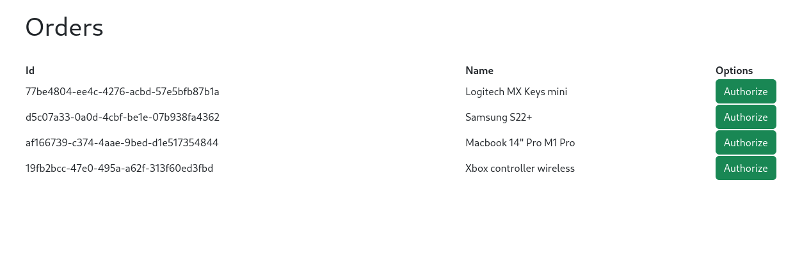

# Exercise 7 - Orders Approval

<br>

## 1. Install dependencies
```bash
$ npm i
```

<br>

## 2. Start RabbitMQ server with docker-compose
```bash
$ docker-compose -f src/exercise-7-rabbitmq/docker-compose.yml up
```

<br>

## 3. Produce some orders
```bash
$ node src/exercise-7-rabbitmq/producer.js
```

<br>

## 4. Start the server
```bash
$ node src/exercise-7-rabbitmq/server.js
```

<br>

## 5. Access http://localhost:3000/


Click on "Authorize" to acknowledge the order and remove from the queue
